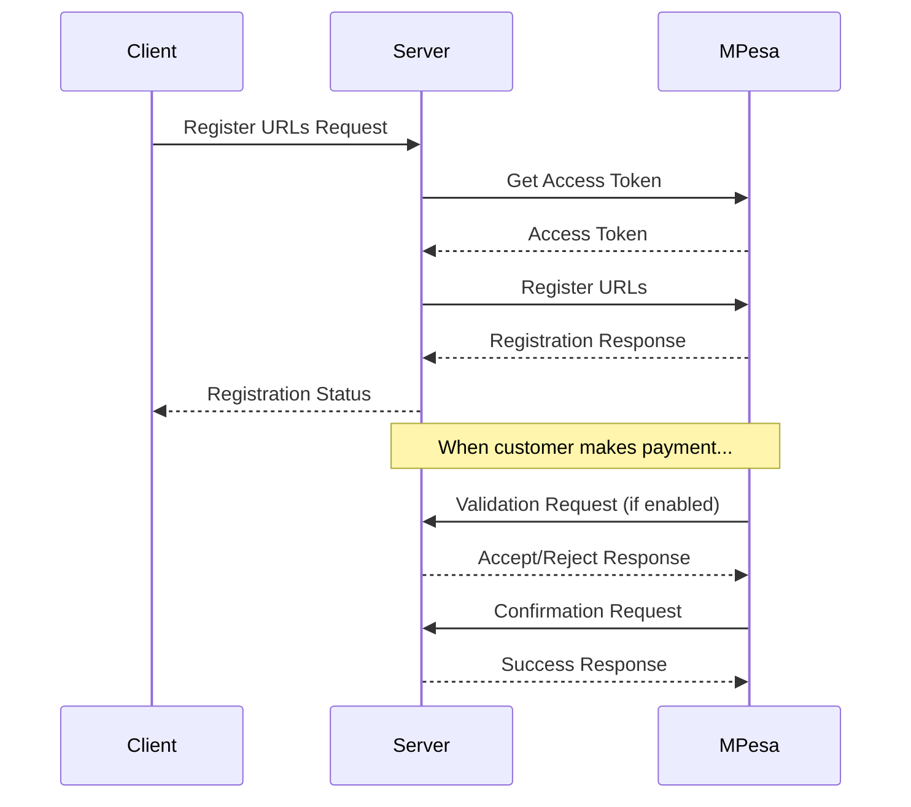

# M-Pesa C2B Register URL Implementation

A Node.js implementation of Safaricom's M-Pesa Customer to Business (C2B) Register URL API. This service allows businesses to register validation and confirmation URLs for receiving payment notifications on their paybill/till numbers.

## Core Components Explained

### 1. Authentication Service (`auth.js`)

The authentication service handles OAuth authentication with M-Pesa's API. Here's how it works:

```javascript
// Token caching mechanism
let tokenCache = {
  token: null,
  expiry: null
};
```
- Implements in-memory token caching
- Stores both the token and its expiry time
- Prevents unnecessary API calls

**Key Features:**
- Token caching for 50 minutes (10-minute safety buffer)
- Automatic token refresh
- Environment variable validation
- Secure error handling

**Authentication Flow:**
1. Check for valid cached token
2. Validate environment variables
3. Generate base64 encoded authentication
4. Request new token from M-Pesa
5. Cache token with expiry
6. Return token for API use

### 2. URL Registration (`register.js`)

The URL registration route handles registering your callback URLs with M-Pesa:

**Key Features:**
- HTTPS URL validation
- Environment variable checks
- Error handling with specific responses
- Token authentication

**Registration Process:**
1. Validate required environment variables
2. Verify HTTPS URLs
3. Get authentication token
4. Register URLs with M-Pesa
5. Handle and log response

### 3. Payment Handlers (`mpesa.js`)

Implements two crucial endpoints for M-Pesa integration:

**Validation Endpoint:**
- Receives payment validation requests
- Implements custom validation logic
- Returns accept/reject response

**Confirmation Endpoint:**
- Receives successful payment notifications
- Processes transaction details
- Always responds with success

## Features

- 🔐 OAuth Authentication with token caching
- 📝 URL Registration with M-Pesa
- ✅ Payment Validation endpoint
- 💰 Payment Confirmation handling
- 🔒 Secure HTTPS enforcement
- 🚀 Built with Express.js

## System Architecture



## Prerequisites

- Node.js >= 14.x
- npm >= 6.x
- M-Pesa API credentials (Consumer Key and Secret)
- HTTPS URLs for validation and confirmation endpoints

## Installation

1. Clone the repository
2. Install dependencies:
```bash
npm install
```
3. Create a `.env` file with the following variables:
```env
CONSUMER_KEY=your_consumer_key
CONSUMER_SECRET=your_consumer_secret
SHORT_CODE=your_shortcode
CONFIRMATION_URL=https://your-domain/api/c2b/confirmation
VALIDATION_URL=https://your-domain/api/c2b/validation
MPESA_BASE_URL=https://sandbox.safaricom.co.ke
PORT=5000
```

## Project Structure

```
├── server.js           # Application entry point
├── routes/
│   ├── mpesa.js       # Validation and confirmation handlers
│   └── register.js    # URL registration endpoint
├── services/
│   └── auth.js        # M-Pesa authentication service
└── package.json       # Project dependencies
```

## API Endpoints

### Register URLs
```http
POST /api/register/url
```

Registers validation and confirmation URLs with M-Pesa.

**Response:**
```json
{
    "OriginatorCoversationID": "7619-37765134-1",
    "ResponseCode": "0",
    "ResponseDescription": "success"
}
```

### Validation URL
```http
POST /api/c2b/validation
```

Handles payment validation requests from M-Pesa.

**Response:**
```json
{
    "ResultCode": "0",
    "ResultDesc": "Accepted"
}
```

### Confirmation URL
```http
POST /api/c2b/confirmation
```

Receives successful payment confirmations.

**Response:**
```json
{
    "ResultCode": 0,
    "ResultDesc": "Success"
}
```

## Configuration Options

| Variable | Description | Required |
|----------|-------------|----------|
| CONSUMER_KEY | M-Pesa API Consumer Key | Yes |
| CONSUMER_SECRET | M-Pesa API Consumer Secret | Yes |
| SHORT_CODE | Your Paybill/Till Number | Yes |
| CONFIRMATION_URL | Payment confirmation endpoint | Yes |
| VALIDATION_URL | Payment validation endpoint | Yes |
| MPESA_BASE_URL | M-Pesa API base URL | Yes |
| PORT | Server port (default: 5000) | No |

## Error Codes

| Code | Description |
|------|-------------|
| C2B00011 | Invalid MSISDN |
| C2B00012 | Invalid Account Number |
| C2B00013 | Invalid Amount |
| C2B00014 | Invalid KYC Details |
| C2B00015 | Invalid Shortcode |
| C2B00016 | Other Error |

## Security Features

- Token caching (50-minute validity)
- HTTPS enforcement for URLs
- CORS protection
- Environment variable validation
- Error message sanitization

## Development

Start the server in development mode:

```bash
npm start
```

The server will start on the configured port (default: 5000).

## Best Practices

1. **Token Management**
   - Implements token caching to reduce API calls
   - 50-minute token expiry (M-Pesa tokens last 1 hour)

2. **Error Handling**
   - Comprehensive error catching
   - Meaningful error messages
   - Proper HTTP status codes

3. **Security**
   - HTTPS URL validation
   - Secure environment variable handling
   - Protected sensitive information

4. **Reliability**
   - Graceful server shutdown
   - Uncaught exception handling
   - Structured logging

## License

This project is licensed under the ISC License.

## Contributing

1. Fork the repository
2. Create a feature branch
3. Commit your changes
4. Push to the branch
5. Create a Pull Request

## Support

For support or questions about the implementation, please raise an issue in the repository or contact the Safaricom API support team at apisupport@safaricom.co.ke.

## Acknowledgments

- [Safaricom Daraja API Documentation](https://developer.safaricom.co.ke/)
- [Express.js](https://expressjs.com/)
- [Axios](https://axios-http.com/)